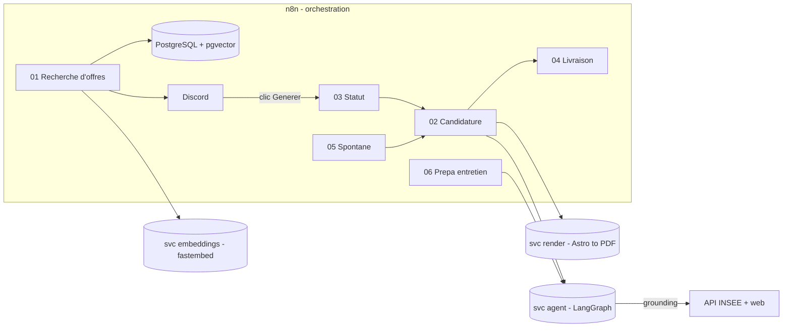

# 🎯 job-hunter

Assistant de recherche d'emploi **semi-automatique** pour développeur IA / backend
(et postes du numérique au sens large). Il collecte des offres sur plusieurs
sources, les dédoublonne (hash + sémantique), les score selon un profil, notifie
sur Discord, puis — sur validation humaine — génère un **CV ciblé par offre**
(Astro → PDF) et une **lettre de motivation** via un agent LLM, prépare la
candidature et un **dossier d'entretien**.

> **Garde-fou non négociable** : le système assiste, il n'invente jamais (ni
> compétence, ni expérience, ni fait sur l'entreprise) et **n'envoie jamais** une
> candidature sans relecture humaine.

PostgreSQL est la **seule source de vérité**. n8n orchestre ; l'intelligence
(scoring, accroche, prépa entretien) vit dans un micro-service Python **LangGraph**.

## 🖥️ Deux façons de s'en servir

| | Ce qu'il faut | Pour quoi |
|---|---|---|
| **Mini-interface web** (`just ui`) | agent + render (~200 Mo RAM) | Candidater **depuis une URL** à la demande : coller le lien d'une offre → CV + lettre PDF ciblés → livraison Discord ou téléchargement direct. Sans n8n ni base. |
| **Stack complète** (`just up`) | tous les services | Collecte automatique quotidienne → alertes Discord → suivi des candidatures, relances, statistiques de réponse, digest hebdo. |

La **mini-interface** (Alpine.js, http://localhost:8901) est le poste de pilotage :
générer une candidature, **trier les offres** collectées, **suivre les réponses**,
**préparer un entretien** en un clic, **démarcher** une entreprise en spontané, et
lire les **statistiques de taux de réponse**. Détail : [`docs/interface.md`](docs/interface.md).

📖 **Documentation complète** : **<https://benjsant.github.io/n8n_jobs_pipeline/>**
(installation, mini-interface, clés & sources, historique Airtable, choix
technologiques, référence API + schéma SQL).

---

## ✨ Ce que ça fait

| Étape | Détail |
|---|---|
| **Collecte** | 3 sources câblées : **France Travail**, **JobSpy** (LinkedIn/Indeed/Glassdoor), **La Bonne Alternance**. Normaliseurs Adzuna / SerpApi / JSearch / WTTJ prêts dans `lib/sources.mjs` (réactivables). Multi-profils multi-zones, cron quotidien 8h. |
| **Dédup** | Hash exact `SHA256` canonicalisé (accent-insensible) **+ dédup sémantique** (embeddings pgvector, cosinus ≥ 0.80) : quasi-doublons intra-lot **et inter-collectes** (anti-join HNSW en base). |
| **Filtre géo** | Écarte l'étranger non frontalier (la recherche par ville déborde sur la Belgique). |
| **Scoring** | 0-100 piloté par le profil + affinage LLM du top-N. Exclusions = filtre dur. |
| **Notif** | Discord 2 canaux : `jobs-alerts` (actionnable, liens **signés** par `WEBHOOK_SECRET`) et `jobs-log` (récap technique + **alertes d'échec**). |
| **Agent** | Graphe LangGraph : jugement d'adéquation, accroche groundée **auto-corrigée**, personnalisation CV bornée par un garde-fou anti sur-masquage. |
| **Enrichissement** | Registre officiel INSEE (`recherche-entreprises.api.gouv.fr`, sans clé) **+** web léger, pour ancrer les faits entreprise. |
| **CV ciblé par offre** | 2 styles (ATS par défaut / design), rendu Astro → PDF. L'agent met en avant **et masque** compétences et projets selon l'offre (`highlight_*` / `hidden_*`) : le CV patron porte tout, le CV envoyé reste ciblé. *DeepSeek produit des données, Astro fait le rendu.* |
| **Lettre** | Corps figé validé + accroche LLM, assemblage **déterministe** (**6 templates** typés : ia-junior, backend, frontend, alternance, spontanée, employé du numérique). |
| **Spontané** | Entreprises LBA sans offre → alerte avec lien + génération de lettre spontanée. |
| **Entretien** | Webhook → dossier de prépa (faits entreprise, atouts, écarts à anticiper, questions probables + réponses). |
| **Livraison** | CV + lettre livrés sur Discord. Validation humaine. (Gmail brouillon + Drive dans l'historique git.) |
| **Suivi & stats** | Page « Mes candidatures » : statuts (postulé → entretien → refus/accepté), relances, notes, prépa entretien en un clic, **taux de réponse** par template / score / source. |
| **Digest & alertes** | Digest hebdomadaire (dimanche) + notification Discord dès qu'un workflow échoue. |
| **Historique** | Miroir **Airtable** optionnel quand on marque « Postulé » ; **Metabase** (opt-in) pour les dashboards. |

---

## 🧱 Architecture



**Division des responsabilités** : n8n fait ce qu'il fait bien (scheduling, API,
Postgres, Discord) ; LangGraph porte les décisions LLM, le tool calling (recherche
entreprise) et l'auto-correction.

### Le graphe de l'agent

```
START -> analyze -> research -> accroche -> judge <-> (retry max 3) -> validate -> END
```

- **analyze** : jugement (score + sous-scores, matching/missing, personnalisation CV).
- **research** : faits officiels (INSEE) + web — *grounding anti-invention*.
- **accroche** : 2-3 phrases groundées (le corps de la lettre est figé hors LLM).
- **judge** : auto-évaluation déterministe (clichés, superlatifs, tiret cadratin,
  longueur) → régénère si rejet.
- **validate** : nettoyage déterministe + sortie au format contractuel.

---

## 🛡️ Parti pris d'ingénierie

- **Anti-invention de bout en bout** : lettre à corps figé, CV = données vs rendu,
  valeurs mises en avant/masquées **vérifiées contre le profil réel**, grounding
  officiel prioritaire sur le web, juge anti-clichés, relecture humaine.
- **Source unique de logique** : la dédup/scoring/géo et les normaliseurs vivent
  dans [`workflows/lib/`](workflows/lib/) ; le jsCode de **12 nœuds n8n** est
  **généré** (`just build-nodes`) avec un garde-fou de parité (`--check`) qui
  casse la CI en cas de divergence.
- **Testé comme du code de prod** : ~70 tests JS, tests pytest (dont des
  **cassettes LLM** rejouant le graphe de bout en bout, sans clé ni coût), tests
  d'intégration Postgres et de câblage des workflows. CI GitHub Actions à chaque push.
- **Tout self-hosted et quasi gratuit** : embeddings locaux (fastembed, sans clé),
  API publiques (INSEE, LBA), DeepSeek (peu cher).

---

## 🧰 Stack

n8n (Docker) · **PostgreSQL + pgvector** · Python **LangGraph** + FastAPI ·
**fastembed** (embeddings locaux) · DeepSeek (LLM) · Astro → PDF (Playwright) ·
mini-interface **Alpine.js** · Discord · APIs France Travail / JobSpy / LBA / INSEE
(+ normaliseurs Adzuna / SerpApi / JSearch / WTTJ prêts) · **Airtable** + **Metabase** (optionnels) ·
Gmail + Drive (optionnels). Détail et justification : [`docs/choix-techniques.md`](docs/choix-techniques.md).

---

## 🚀 Démarrage rapide

```bash
# 1. Secrets
cp .env.example .env
openssl rand -hex 32          # -> N8N_ENCRYPTION_KEY
# remplir au minimum : DEEPSEEK_API_KEY + 1 source + DISCORD_WEBHOOK_ALERTS

# 2. Lancer la stack (postgres pgvector, n8n, jobspy, render, agent, embeddings)
docker compose up -d          # ou : just up

# 3. n8n -> http://localhost:8978 (login dans .env)
#    Importer workflows/*.json, associer la credential Postgres, activer.

# 4. Tests hors stack (aucune clé)
just test                     # suites JS + garde-fou de parité des nœuds
```

> **Usage à la demande (sans déployer)** : `just ui` (ou `./start.sh --ui`) lance
> la mini-interface web sur http://localhost:8901 — générer depuis une URL, **trier
> les offres** (postulé / ignoré / réanalyser / supprimer / purge), **suivre les
> candidatures**, préparer un entretien, démarcher les entreprises (spontanée).
> Voir [`docs/interface.md`](docs/interface.md).

> **Lanceur tout-en-un** : `./start.sh` démarre toute la stack (vérifie Docker,
> crée le `.env` au besoin), affiche les URLs et s'arrête proprement au Ctrl-C.
> Options `--ui` (mode léger) et `--metabase` (dashboards).

> Première install / déploiement VPS : voir [`docs/installation.md`](docs/installation.md)
> et [`docs/deploiement-vps.md`](docs/deploiement-vps.md) (WireGuard + SSH durci).

---

## 🗂️ Structure

```
workflows/        # 8 workflows n8n (JSON versionnés) + lib/ (logique testée, générée)
prompts/          # agent-system-prompt.md — comportement & garde-fous de l'agent
services/
  agent-langgraph/  # agent (scoring, accroche, prépa entretien) + mini-interface web
  embeddings/       # dédup sémantique (fastembed)
  jobspy/           # source LinkedIn/Indeed/Glassdoor
cv/               # CV maître Astro (2 styles) + données *.json + service de rendu
assets/letters/   # 6 templates de lettres (corps figé)
db/               # schéma SQL (source de vérité) + seed profils
docs/             # documentation MkDocs (publiée sur GitHub Pages)
```

Le dossier `docs/` est publié en site : **<https://benjsant.github.io/n8n_jobs_pipeline/>**.

| Workflow | Rôle | Déclencheur |
|---|---|---|
| `01-recherche-offres` | collecte → dédup → géo → scoring → Discord | cron 8h |
| `02-agent-candidature` | agent → CV + lettre (PDF) → livraison | Execute / formulaire |
| `03-statut-offre` | actions Discord → statut → lance `02` | webhook (signé) |
| `04-candidature-finalisation` | livraison Discord (CV + lettre en PJ) | Execute |
| `05-candidature-spontanee` | entreprise LBA sans offre → `02` spontané | webhook (signé) |
| `06-prepa-entretien` | offre → dossier d'entretien | webhook (signé) |
| `07-digest-hebdo` | récap hebdo + candidatures à relancer → Discord | cron dimanche |
| `08-notification-erreurs` | tout workflow en échec → alerte jobs-log | Error Trigger |

> Déploiement en une commande : **`just deploy-workflows`** (associe la credential
> Postgres réelle, importe, réactive, redémarre n8n). Crons en `Europe/Paris`
> (`GENERIC_TIMEZONE`). Liens d'action Discord protégeables par `WEBHOOK_SECRET`.

---

## 🤖 Configurer l'agent

Le comportement de l'agent est défini dans
[`prompts/agent-system-prompt.md`](prompts/agent-system-prompt.md) — c'est le
fichier le plus important du projet (format de sortie, garde-fous, voix). Le profil
candidat vit dans `cv/*.json`, synchronisé depuis le portfolio (`just cv-sync`),
sans invention.

DeepSeek est compatible OpenAI : le service agent pointe sur
`https://api.deepseek.com` (`deepseek-chat` par défaut).

---

## 🔒 Sécurité & garde-fous

- `.env` jamais commité (vérifié par `scripts/check-no-personal-data.sh` + hook).
- PostgreSQL reste la source de vérité (Notion n'est pas le stockage).
- Relecture humaine obligatoire avant tout envoi ; aucune candidature n'est envoyée.
- **Écoute locale par défaut** (`BIND_HOST=127.0.0.1`). Pour ouvrir au réseau :
  `WEBHOOK_SECRET` (signe les liens d'action Discord) et `UI_TOKEN` (protège la
  mini-interface, jeton exigé sur toutes les routes) sont là pour ça.
- API/RSS officiels privilégiés au scraping direct.

---

## 📈 Évolution (v0.1 → v0.2)

Démarré comme un pipeline n8n avec un agent DeepSeek monolithique (v0.1), puis
l'agent a été **extrait dans un service LangGraph** (v0.2) une fois les limites du
prompt unique mesurées (retry, checkpointing, tool calling, auto-correction). n8n
reste l'orchestrateur. Détails et décisions : [`docs/plan-langgraph.md`](docs/plan-langgraph.md)
et [`docs/contexte-claude.md`](docs/contexte-claude.md).
