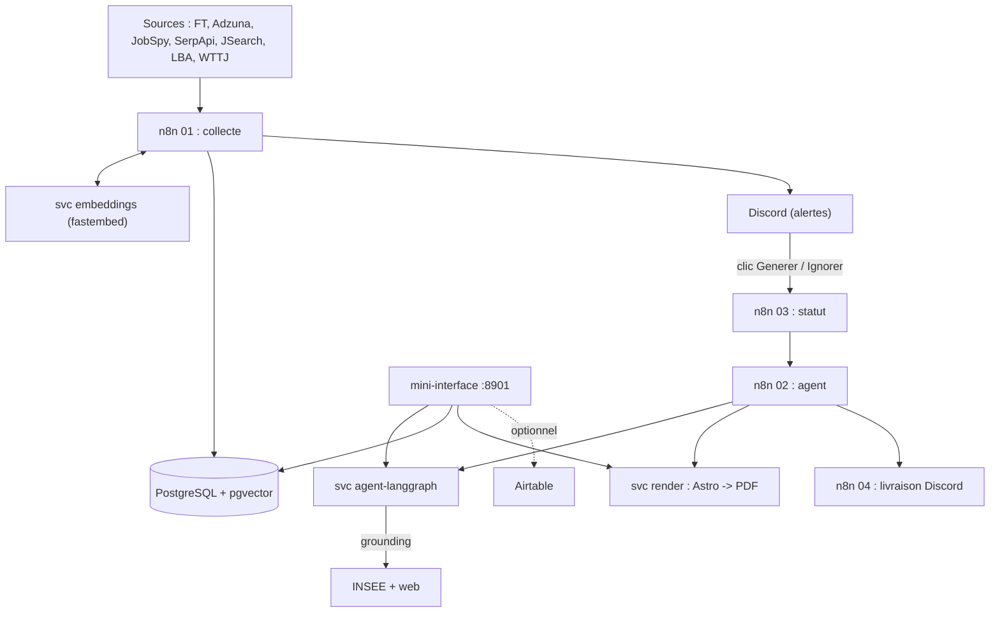
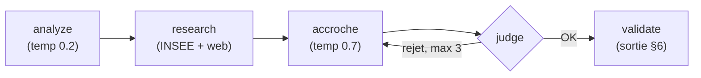
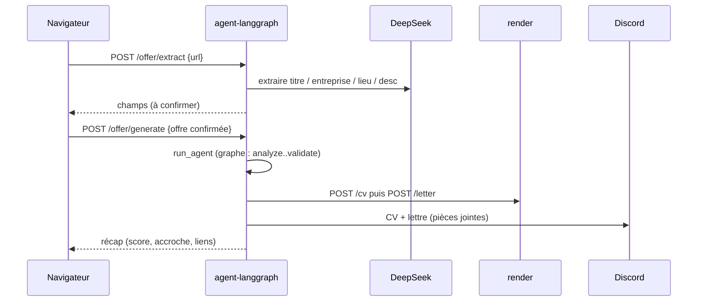

# Guide technique (mainteneur)

Doc pensée pour **revenir sur le projet après des mois** et le modifier sans
stress : comment tout s'emboîte, où se trouve quoi, quoi toucher pour tel
changement, comment tester, et les pièges à connaître.

À lire aussi : [Choix technologiques](choix-techniques.md) (le pourquoi) et
[Référence API + schéma SQL](reference.md) (les détails exacts).

## 1. Vue d'ensemble

Trois responsabilités, trois mondes :

- **n8n** (orchestration) : cron, appels aux sources, écritures Postgres, Discord,
  webhooks d'action. Ne contient **aucune** décision intelligente durable.
- **agent-langgraph** (Python) : toute l'intelligence (scoring, accroche, prépa
  entretien) + la mini-interface web + les routes de suivi.
- **render** (Node/Astro) : transforme des données en **PDF** (CV + lettre).

Plus : **postgres** (source de vérité + persistance n8n), **embeddings**
(vecteurs dédup), **jobspy** (collecte LinkedIn/Indeed), **metabase** (dashboards,
opt-in), **cleanup** (purge de `./output`).



Deux points d'entrée utilisateur :

- **stack complète** (`just up`) : collecte automatique + alertes Discord ;
- **mini-interface** (`just ui` ou `./start.sh`) : usage à la demande depuis le
  navigateur (générer, trier, suivre).

## 2. Carte du dépôt

```
workflows/
  0X-*.json              6 workflows n8n (exports versionnés)
  lib/
    offer-utils.mjs      SOURCE UNIQUE : norm, dédup, cosim, géo, scoreOffer
    sources.mjs          normaliseurs par source (FT, Adzuna, LBA, JobSpy...)
    llm-scoring.mjs      affinage LLM du scoring
    company-enrichment.mjs
    render-payloads.mjs  construction des payloads vers le service render
    build-nodes.mjs      GÉNÈRE le jsCode des nœuds Code du 01 (+ --check)
    *.test.mjs           tests node (aucune clé, aucune stack)

services/
  agent-langgraph/
    app.py               routes FastAPI (interface + suivi + génération)
    agent/
      graph.py           graphe LangGraph : analyze->research->accroche->judge->validate
      interview.py       graphe prépa entretien
      schema.py          contrat de sortie (§6) + modèles Pydantic
      tools.py           grounding : registre INSEE + web (DuckDuckGo)
      offer_extract.py   extraction URL, génération offre/spontanée, livraison Discord
      db.py              accès Postgres (offres, candidatures, entreprises)
      airtable.py        miroir Airtable optionnel
      llm.py             client DeepSeek (compatible OpenAI)
    static/index.html    mini-interface (Alpine.js, un seul fichier)
    tests/               pytest (mock LLM, pas de clé)
  embeddings/            micro-service fastembed
  jobspy/                micro-service collecte

cv/
  template-ats.astro     CV ATS (défaut)
  template.astro         CV design
  server.mjs             service HTTP render : POST /cv, POST /letter
  letter-template.mjs    assemblage lettre (corps figé + accroche)
  *.json                 profil candidat (profile/skills/projects/experiences/education)
  scripts/sync-from-portfolio.mjs   just cv-sync

assets/letters/          5 templates de lettres (corps figé) + README
db/
  schema.sql             SCHÉMA (source de vérité) : voir pièges §9
  seed-profiles.sql      profils de recherche
  init-metabase.sh       crée la base metabase
docs/                    cette documentation (MkDocs)
Justfile                 toutes les commandes (just up / ui / test / ...)
start.sh                 lanceur tout-en-un (Ctrl-C propre)
docker-compose.yml       la stack
```

## 3. Modèle de données (invariants)

Tables clés (schéma exact : [reference.md](reference.md)) :

- **offers** : `hash` = `SHA256(title+company+location)` canonicalisé, unique
  (dédup exacte). `status` dans `new/reviewed/selected/ignored/applied`. `embedding`
  (pgvector) pour la dédup sémantique.
- **companies** : `name` unique. Contact LBA : `apply_url`, `phone`, `email`.
- **applications** : le suivi. **Champs dénormalisés** (`poste`, `entreprise`,
  `lien`, `score`) pour **survivre à la suppression d'une offre** (`offer_id` est
  en `ON DELETE SET NULL`). `airtable_id` relie la ligne miroir Airtable.
- **search_profiles** : configs de recherche multi-profils (le `01` boucle dessus).

Invariants à ne pas casser :

- une offre déjà vue (même `hash`) n'est jamais réinsérée ;
- supprimer une offre ne doit pas perdre une candidature (d'où le SET NULL + les
  snapshots) ;
- le LLM ne produit **jamais** de fait sur l'entreprise sans grounding.

## 4. Les workflows n8n

| Workflow | Rôle | Déclencheur |
|---|---|---|
| `01-recherche-offres` | collecte -> dédup (hash + sémantique) -> géo -> scoring -> Discord ; upsert entreprises LBA | cron |
| `02-agent-candidature` | POST vers l'agent -> rendu CV+lettre -> livraison | Execute |
| `03-statut-offre` | clic Discord (selected/ignored) -> statut -> lance `02` | webhook |
| `04-candidature-finalisation` | livraison Discord (Gmail/Drive optionnels) | Execute |
| `05-candidature-spontanee` | entreprise LBA sans offre -> `02` en mode spontané | webhook |
| `06-prepa-entretien` | offre -> dossier d'entretien (agent) | webhook |

Le **jsCode des nœuds Code du `01` est généré** depuis `offer-utils.mjs` par
`build-nodes.mjs`. Ne modifie **jamais** ce jsCode dans le JSON à la main : change
`offer-utils.mjs`, lance `just build-nodes`, et `just test` vérifie la parité
(`--check`). Cross-appels câblés par `id` racine stable (`03->02`, `02->04`,
`05->02`).

## 5. Le service agent

Graphe principal (`graph.py`) :



- **analyze** (temp 0.2) : score + sous-scores, matching/missing, personnalisation
  CV, conseils, objet email. Tout le §6 **sauf** la lettre.
- **research** : grounding via `tools.py` (registre INSEE `recherche-entreprises`,
  sans clé, prioritaire ; web DuckDuckGo en complément). Tolérant au réseau coupé.
- **accroche** (temp 0.7) : choix du template + 2-3 phrases groundées. Le **corps**
  de la lettre est figé hors LLM.
- **judge** : auto-évaluation déterministe (clichés, superlatifs, tiret cadratin) ->
  régénère si rejet.
- **validate** : nettoyage + sortie au **contrat §6** (`schema.py`, `AgentOutput`).

Le **contrat de sortie §6** est la frontière : n8n comme la mini-interface en
dépendent. Si tu changes un champ de `AgentOutput`, mets à jour les consommateurs
(render payloads, interface, éventuellement `prompts/agent-system-prompt.md`).

`app.py` expose aussi le suivi : `/offers*`, `/applications*`, `/companies*`
(voir le tableau des routes dans [interface.md](interface.md)).

## 6. Le service render

Deux endpoints (`cv/server.mjs`) :

- `POST /cv` `{ application_id, personalization }` -> rend le CV (Astro) en PDF ;
- `POST /letter` `{ application_id, company, template, accroche, vars }` -> assemble
  la lettre (corps figé `assets/letters/<template>.md` + accroche) et rend le PDF.

Règle d'or : **le LLM ne touche pas le rendu**. Il fournit des données
(`personnalisation_cv`, `accroche`, `template`). Astro/Playwright produisent le PDF.
Deux styles via `CV_STYLE` (`ats` par défaut, ou `design`).

## 7. La mini-interface

Un seul fichier `static/index.html` (Alpine.js, sans build). Structure : un objet
`app()` avec l'état et les méthodes (`loadOffers`, `setStatus`, `reanalyze`,
`purgeOffers`, `loadApplications`, `updateApp`, `prepInterview`, `loadCompanies`,
`applySpontaneous`, `applyManual`). Chaque section = une carte. Les données viennent
des routes FastAPI de `app.py`.

Pour ajouter une section : (1) une route dans `app.py` (+ fonction db si besoin) ;
(2) une carte HTML + une méthode Alpine ; (3) l'appeler dans `x-init`.

Flux type « générer une candidature depuis une URL » :



## 8. « Je veux changer X »

| Objectif | Fichiers à toucher | Test |
|---|---|---|
| **Ajouter une source d'offres** | `workflows/lib/sources.mjs` (normaliseur) + le nœud HTTP dans `01` | `sources.test.mjs` |
| **Changer le scoring / la géo / la dédup** | `workflows/lib/offer-utils.mjs` puis `just build-nodes` | `offer-utils.test.mjs` + `--check` |
| **Changer le comportement de l'agent** | `prompts/agent-system-prompt.md` (voix, garde-fous) et/ou les nœuds de `graph.py` | `tests/test_graph.py` |
| **Ajouter un champ à la sortie agent** | `agent/schema.py` + consommateurs (render-payloads, interface) | pytest |
| **Ajouter un template de lettre** | `assets/letters/<nom>.md` + l'autoriser dans `schema.py` (TEMPLATES) | `letter-template.test.mjs` |
| **Modifier le CV (mise en page)** | `cv/template-ats.astro` ou `template.astro` | `just cv-pdf` (visuel) |
| **Modifier le profil candidat** | `cv/*.json` (ou `just cv-sync` depuis le portfolio) | `sync.test.mjs` |
| **Ajouter une route / section interface** | `app.py` + `agent/db.py` + `static/index.html` | pytest + test manuel |
| **Changer le schéma DB** | `db/schema.sql` **et** appliquer la migration à la base qui tourne (voir §9) | `just test-db` |
| **Ajouter une variable d'env** | `.env.example` + `docker-compose.yml` (service concerné) + le code qui la lit | - |

## 9. Boucle de dev locale et pièges

**Rebuild + recharge l'agent après un changement Python :**
```bash
docker build --network=host -t n8n_jobs_pipeline-agent-langgraph:latest ./services/agent-langgraph
docker compose up -d --force-recreate --no-deps agent-langgraph
```

**Pièges à connaître (ceux qui font perdre du temps) :**

- **Le schéma ne s'applique qu'à un volume Postgres VIDE.** `db/schema.sql` tourne
  seulement au premier init. Sur une base déjà créée, applique tes `ALTER`/migrations
  à la main (`docker exec ... psql`) **en plus** de les ajouter (idempotents) à
  `schema.sql`.
- **`--network=host` au build** : le DNS du builder Docker peut coincer ; les images
  se buildent avec `docker build --network=host` (documenté dans les Dockerfiles).
- **Ports : interne vs hôte.** n8n écoute **5678** dans le conteneur ; l'hôte publie
  **8978** (`N8N_PORT`). Idem interface **8001**->**8901** (`UI_PORT`). Si tu changes
  `N8N_PORT`, aligne `WEBHOOK_URL`.
- **Écoute locale par défaut.** Les ports sont publiés sur `127.0.0.1` (`BIND_HOST`),
  car la mini-interface n'a **pas d'authentification**. Pour ouvrir au réseau local
  (ou binder l'IP WireGuard sur VPS), mets `BIND_HOST=0.0.0.0` (ou l'IP voulue).
- **Fichiers root-owned** : un conteneur qui écrit dans un volume monté crée des
  fichiers `root`. Nettoyer via `docker run ... alpine rm` ou `--user "$(id -u):$(id -g)"`.
- **Coût DeepSeek** : les chemins de génération réelle (agent, prépa entretien,
  spontanée) appellent l'API et postent sur Discord. En test, privilégie les
  fonctions db/airtable en isolation (comme les tests existants).
- **Airtable** : `AIRTABLE_BASE_ID` = segment `app...` d'une base **à laquelle le
  token a accès** (scopes `data.records:write` + `schema.bases:*` pour la création).
- **Style** : pas d'emoji ni de tiret cadratin (`—`) dans l'interface ni les
  contenus générés (marqueur IA). Le juge de l'agent nettoie déjà les tirets.

## 10. Tests et CI

- `just test` : suites **JS** (libs) + **garde-fou de parité** des nœuds (`--check`).
  Sans clé, sans stack, en conteneur Node.
- `just test-py` : schéma de sortie agent (LLM mocké), en conteneur Python.
- `just test-db` : intégration de la couche candidature (Postgres jetable).
- `pytest` (dans l'image agent) : db (validation), airtable, graph, interview, tools.
- **GitHub Actions** : ces suites à chaque push (workflow CI) + build/déploiement de
  cette doc (workflow Docs, `mkdocs build --strict`).

Règle : un changement de logique métier passe par une lib testée (`workflows/lib/`
ou `agent/`), pas par du code copié dans un nœud n8n.

## 11. Où regarder en premier si ça casse

| Symptôme | Piste |
|---|---|
| Offres non collectées | clés source dans `.env` ? logs `01` dans n8n ? |
| Alerte Discord vide/`undefined` | un `RETURNING` manquant dans un nœud Postgres |
| Génération échoue | `DEEPSEEK_API_KEY` ? service `render` up ? volume `./output` ? |
| `/offers` ou `/applications` en 503 | Postgres pas lancé (mode `just ui` seul) |
| Parité CI rouge | `offer-utils.mjs` modifié sans `just build-nodes` |
| Schéma absent après un `ALTER` | base non vide : migration à appliquer à la main |

## 12. Dette technique connue et limites

À garder en tête avant de refactorer (rien de bloquant, mais autant le savoir) :

- **`static/index.html` grossit** : la mini-interface porte beaucoup de sections
  dans un seul fichier Alpine. Si on ajoute encore, envisager de découper le HTML
  et le JS (ou passer à des composants). Seuil de gêne, pas d'urgence.
- **Aucune authentification** sur la mini-interface (:8901) : réservé au local.
  Ne jamais l'exposer publiquement sans reverse-proxy + auth.
- **Chemins de génération réelle non testés automatiquement** : `run_agent`,
  prépa entretien et spontanée appellent DeepSeek (coût + clé), donc les tests
  couvrent les fonctions autour (db, airtable, validation) mais pas l'appel LLM
  de bout en bout. Vérification manuelle recommandée après un changement de prompt.
- **Duplication contrôlée** : le nœud `norm LBA recruteurs` du `01` est une copie
  inline de `sources.mjs` (tenue synchro à la main pour le champ `email`). Le reste
  des nœuds du `01` est généré (pas de duplication).
- **Couplage aux API externes** : DeepSeek, LBA, INSEE, sources. Un changement de
  leur format casse un maillon ; les normaliseurs isolent l'impact, mais surveiller.
- **Multi-profils partiel côté interface** : `search_profiles` gère le multi-profil
  côté collecte, mais la mini-interface ne l'expose pas encore.
- **Un seul environnement de base Airtable** : `AIRTABLE_BASE_ID` unique ; pas de
  multi-base.

Idées d'évolution notées mais non faites : documents PDF liés à chaque candidature
dans le suivi, recherche/filtre dans les listes, export CSV, relance Discord
automatique (suppose la stack allumée en permanence, hors esprit « local à la
demande »).
